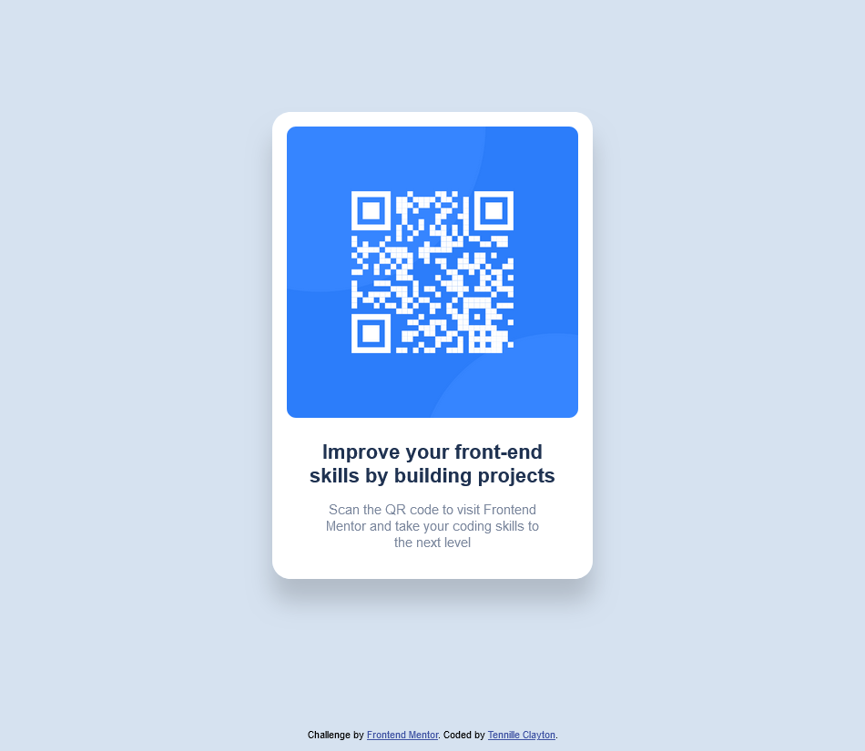

# Frontend Mentor - QR code component solution

This is a solution to the [QR code component challenge on Frontend Mentor](https://www.frontendmentor.io/challenges/qr-code-component-iux_sIO_H). Frontend Mentor challenges help you improve your coding skills by building realistic projects.

## Table of contents

- [Overview](#overview)
  - [Screenshot](#screenshot)
  - [Links](#links)
- [My process](#my-process)
  - [Built with](#built-with)
  - [What I learned](#what-i-learned)
  - [Useful resources](#useful-resources)
- [Author](#author)

**Note: Delete this note and update the table of contents based on what sections you keep.**

## Overview

### Screenshot

### Links

- Solution URL: [GitHub](https://github.com/tennilleclayton/qr-code-component-main)
- Live Site URL: [http://tennilleclayton.github.io/qr-code-component-main](http://tennilleclayton.github.io/qr-code-component-main)

## My process

### Built with

- Semantic HTML5 markup
- CSS custom properties

### What I learned

Loved the simple challenge.

### Useful resources

- [MDN Web Docs](https://developer.mozilla.org/en-US/)
- [W3Schools](https://www.w3schools.com/css/default.asp)
- [Web.Dev](https://web.dev/learn)

## Author

- Website - [Tennille Clayton](https://github.com/tennilleclayton)
- Frontend Mentor - [@tennilleclayton](https://www.frontendmentor.io/profile/tennilleclayton)
- Twitter - [@tennilleclayton](https://www.twitter.com/tennilleclayton)
